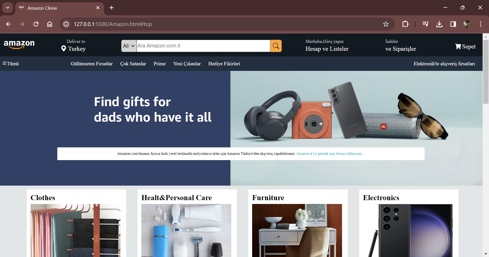
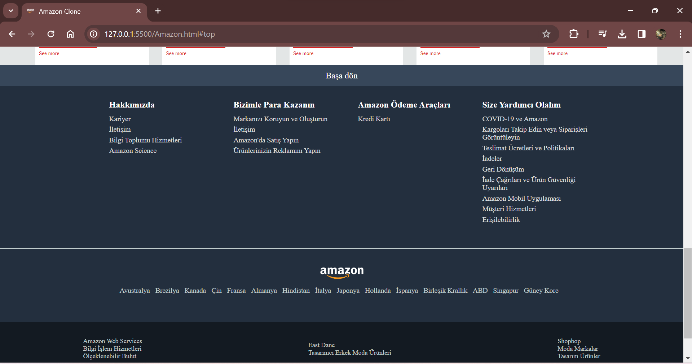

# Amazon Clone Website
This project is a Amazon clone developed using HTML and CSS. The goal of this project is to recreate the user interface of the Amazon platform, focusing on responsive design and modern web development practices.

# Technologies used
- HTML:For the structure of the website.
- CSS:For styling and responsive design.

# Preview

# GIF

